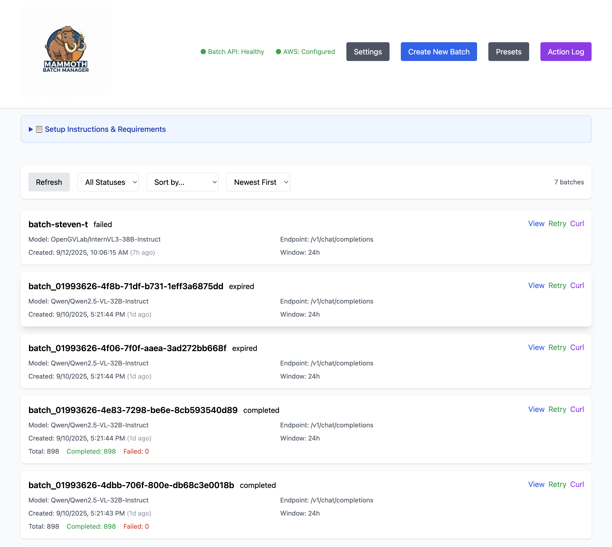

# Mammoth Batch Manager

A lightweight web interface for managing Mammoth Batch API jobs with integrated S3 presigned URL generation.



## Features

- **Batch Management**: View, create, retry, and cancel batch jobs
- **S3 Integration**: Built-in presigned URL generation for input/output files
- **Real-time Updates**: Auto-refresh batch status every 10 seconds
- **Health Monitoring**: Service health checks for Batch API and S3 connectivity
- **Input Validation**: Validates all fields before submission
- **Status Filtering**: Filter batches by status (completed, in progress, failed, etc.)

## Prerequisites

- Python 3.8+
- AWS credentials configured (for S3 access)
- Access to Mammoth Batch API endpoint

## Installation

1. Install dependencies:
```bash
pip install -r requirements.txt
```

2. Configure environment variables (optional):
```bash
export BATCH_API_URL=http://localhost:8000  # Default: http://localhost:8000
export S3_BUCKET_NAME=modular-batch-api-batches  # Default: modular-batch-api-batches
```

## Quick Start

1. Start the application:
```bash
./start.sh
# or
python app.py
```

2. Open your browser to: http://localhost:8080

3. The interface will automatically:
   - Check the health of the Batch API
   - Verify S3 connectivity
   - Load existing batches

## Usage

### Creating a New Batch

1. Click "Create New Batch"
2. Fill in the batch details:
   - **Batch ID**: Unique identifier for your batch
   - **Model**: The model to use (e.g., OpenGVLab/InternVL3-38B-Instruct)
   - **Endpoint**: API endpoint (default: /v1/chat/completions)
   - **Completion Window**: Time limit for batch completion

3. Switch to the "S3 Configuration" tab:
   - Enter your S3 bucket and input key
   - Optionally provide AWS credentials (uses default if not provided)
   - Click "Generate Presigned URLs"
   - URLs will be automatically copied to the batch form

4. Click "Create Batch" to submit

### Managing Existing Batches

- **View Details**: Click "View" to see full batch information
- **Retry**: Available for completed/failed batches with failures
- **Cancel**: Available for running batches
- **Filter**: Use the status dropdown to filter batches

### AWS Credentials

The application supports multiple credential methods:

1. **Default credentials**: Uses AWS CLI/SDK default credentials
2. **Manual entry**: Provide credentials in the S3 Configuration tab
3. **Environment variables**: Standard AWS environment variables

## Architecture

```
batch-manager/
├── app.py          # FastAPI backend server
├── index.html      # Single-page web interface
├── requirements.txt
├── README.md
└── start.sh        # Startup script
```

The application acts as a proxy to the Mammoth Batch API, adding:
- S3 presigned URL generation
- Input validation
- Health monitoring
- User-friendly interface

## API Endpoints

The FastAPI backend provides:

- `GET /`: Serve the web interface
- `GET /api/health`: Health check for Batch API and S3
- `POST /api/generate-presigned-urls`: Generate S3 presigned URLs
- `GET /api/batches`: List all batches
- `GET /api/batches/{batch_id}`: Get batch details
- `POST /api/batches`: Create new batch
- `POST /api/batches/{batch_id}/retry`: Retry a batch
- `POST /api/batches/{batch_id}/cancel`: Cancel a batch

## Troubleshooting

### Batch API Connection Issues
- Verify `BATCH_API_URL` is correct
- Check if the Batch API service is running
- Look for health status indicators in the UI header

### S3 Access Issues
- Verify AWS credentials are configured
- Check bucket permissions
- Ensure the bucket name is correct

### Missing Fields Error
- All required fields must be filled
- Generate presigned URLs before creating a batch
- Model field is required for v2 API mode

## Development

To run in development mode with auto-reload:
```bash
uvicorn app:app --reload --host 0.0.0.0 --port 8080
```